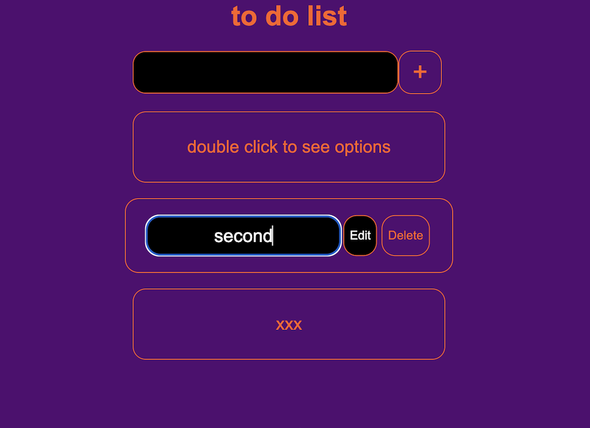
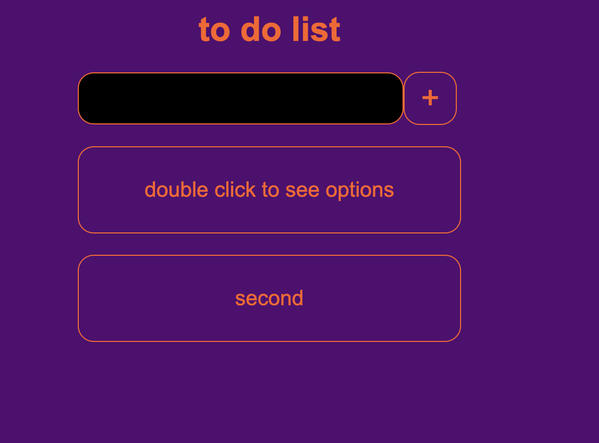

# to-do-list-CRUD

## Description

This is a fullstack "to do list" web application demonstrating; create, retrieve, update and delete methods.
The technologies that were involved in building this web application include: 

+ HTML, CSS and Vanilla Javascript for the client side.

+ Node.js, Express.js on the server side and MariaDB (relational database very simalary to MySQL) to store data.

## Setup

Because this app has not been deployed, it can be downloaded onto the users local machine from the GitHub page.
Please follow the .envEXAMPLE found in the server folder to connect to the data base and then run the schema.sql file in either MariaDB or MySQL (both compatible).
Next (if Nodemon already inslaed) run nodemon server.js from client side and run index.html from client side on liveserver (extension for VS code)

## Usage

To create a new entry - the user simply inputs their message into the input field and then clicks on the plus (+) button, this will also create an entry in the database.

To update - the user double clicks the desired entry, granting the user with ability to edit that particular entry in both database and document.

To delete one of the entry - when the user double clicks, an option to delete is also displayed with the edit option.

